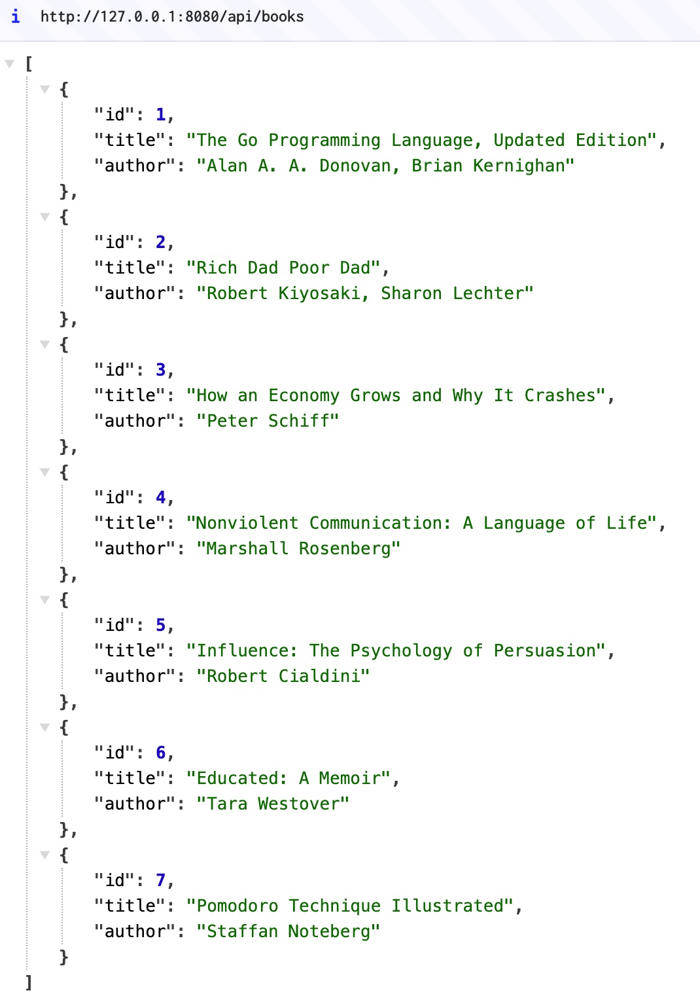

## Go REST framework



```bash
mkdir rest_api
mkdir rest_api/book

cd rest_api
vim main.go
vim book/book.go

go get -u github.com/gin-gonic/gin
go get -u gorm.io/gorm
go get -u gorm.io/driver/sqlite

go run main.go
```

```bash
curl -X POST http://127.0.0.1:9080/api/add_book -H "Content-Type: application/json" -d '{"book_name": "Nonviolent Communication: A Language of Life"}'
curl -X POST http://127.0.0.1:9080/api/add_book -H "Content-Type: application/json" -d '{"book_name": "The Lean Startup"}'
curl -X POST http://127.0.0.1:9080/api/add_book -H "Content-Type: application/json" -d '{"book_name": "How an Economy Grows and Why It Crashes"}'
curl -X POST http://127.0.0.1:9080/api/add_book -H "Content-Type: application/json" -d '{"book_name": "The Willpower Instinct"}'

curl -X GET http://127.0.0.1:9080/api/show_books

curl -X DELETE http://127.0.0.1:9080/api/delete_book/1
curl -X GET http://127.0.0.1:9080/api/show_books
```
