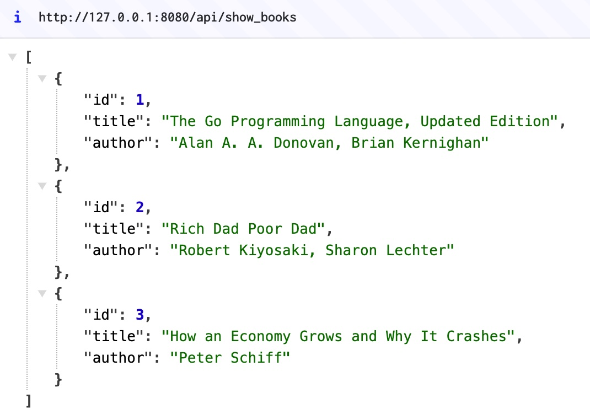

## Go REST framework



```bash
mkdir rest_api_v1
mkdir rest_api_v1/book

cd rest_api
vim main.go
vim book/book.go

go mod tidy

go run main.go
```

```bash
# add books
curl -X POST http://127.0.0.1:8080/api/add_book \
     -H "Content-Type: application/json" \
     -d '{"title": "The Go Programming Language", "author": "Alan A. A. Donovan, Brian Kernighan"}'

curl -X POST http://127.0.0.1:8080/api/add_book \
     -H "Content-Type: application/json" \
     -d '{"title": "Rich Dad Poor Dad", "author": "Robert Kiyosaki, Sharon Lechter"}'

curl -X POST http://127.0.0.1:8080/api/add_book \
     -H "Content-Type: application/json" \
     -d '{"title": "How an Economy Grows and Why It Crashes", "author": "Peter Schiff"}'

curl -X POST http://127.0.0.1:8080/api/add_book \
     -H "Content-Type: application/json" \
     -d '{"title": "Nonviolent Communication: A Language of Life", "author": "Marshall Rosenberg"}'

# get all books
curl -X GET http://127.0.0.1:9080/api/show_books

# update a book
curl -X PUT http://127.0.0.1:8080/api/update_book/1 \
     -H "Content-Type: application/json" \
     -d '{"title": "The Go Programming Language, Updated Edition", "author": "Alan A. A. Donovan, Brian Kernighan"}'

# delete a book
curl -X DELETE http://127.0.0.1:8080/api/delete_book/4
```
