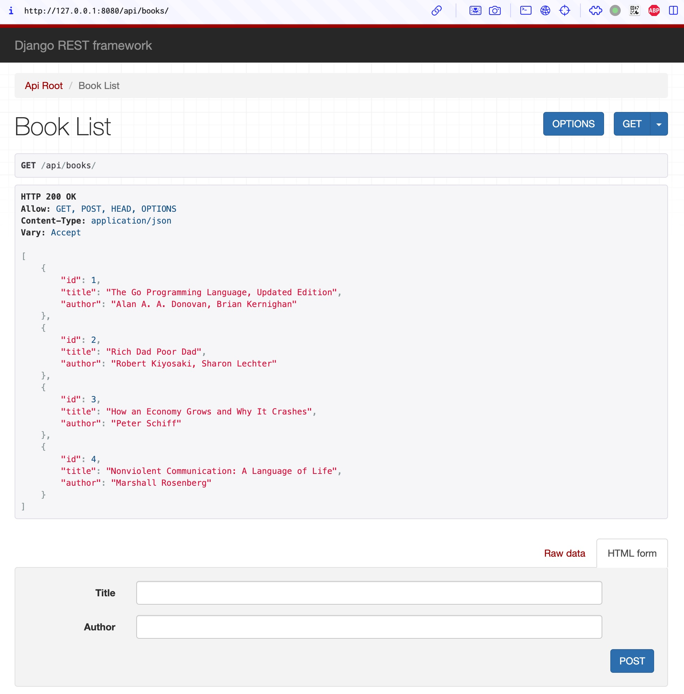

## Django REST framework



```bash
conda install --channel conda-forge django djangorestframework

django-admin startproject rest_api
cd rest_api
django-admin startapp books
vim rest_api/settings.py

vim books/models.py
vim books/serializers.py
vim books/views.py
vim books/urls.py
vim rest_api/urls.py

python manage.py makemigrations
python manage.py migrate
python manage.py runserver 0.0.0.0:9080
```

```bash
curl -X POST http://127.0.0.1:9080/api/add_book -H "Content-Type: application/json" -d '{"book_name": "Nonviolent Communication: A Language of Life"}'
curl -X POST http://127.0.0.1:9080/api/add_book -H "Content-Type: application/json" -d '{"book_name": "The Lean Startup"}'
curl -X POST http://127.0.0.1:9080/api/add_book -H "Content-Type: application/json" -d '{"book_name": "How an Economy Grows and Why It Crashes"}'
curl -X POST http://127.0.0.1:9080/api/add_book -H "Content-Type: application/json" -d '{"book_name": "The Willpower Instinct"}'

curl -X GET http://127.0.0.1:9080/api/show_books

curl -X DELETE http://127.0.0.1:9080/api/delete_book/1
curl -X GET http://127.0.0.1:9080/api/show_books
```
