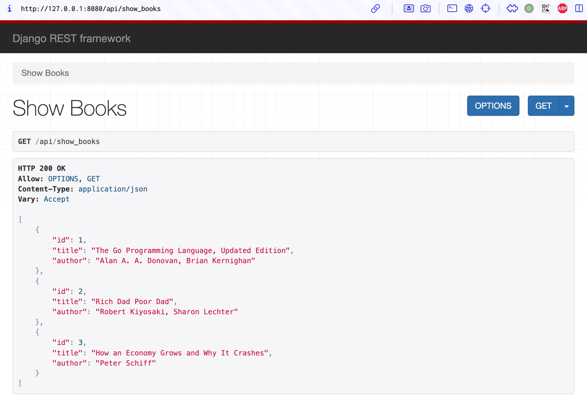

## Django REST framework



```bash
conda install --channel conda-forge django djangorestframework

django-admin startproject rest_api
cd rest_api
django-admin startapp books
vim rest_api/settings.py

vim books/models.py
vim books/serializers.py
vim books/views.py
vim books/urls.py
vim rest_api/urls.py

python manage.py makemigrations
python manage.py migrate
python manage.py runserver 0.0.0.0:8080
```

```bash
# add books
curl -X POST http://127.0.0.1:8080/api/add_book/ \
     -H "Content-Type: application/json" \
     -d '{"title": "The Go Programming Language", "author": "Alan A. A. Donovan, Brian Kernighan"}'

curl -X POST http://127.0.0.1:8080/api/add_book/ \
     -H "Content-Type: application/json" \
     -d '{"title": "Rich Dad Poor Dad", "author": "Robert Kiyosaki, Sharon Lechter"}'

curl -X POST http://127.0.0.1:8080/api/add_book/ \
     -H "Content-Type: application/json" \
     -d '{"title": "How an Economy Grows and Why It Crashes", "author": "Peter Schiff"}'

curl -X POST http://127.0.0.1:8080/api/add_book/ \
     -H "Content-Type: application/json" \
     -d '{"title": "Nonviolent Communication: A Language of Life", "author": "Marshall Rosenberg"}'

# get all books
curl -X GET http://127.0.0.1:9080/api/show_books/

# update a book
curl -X PUT http://127.0.0.1:8080/api/update_book/1/ \
     -H "Content-Type: application/json" \
     -d '{"title": "The Go Programming Language, Updated Edition", "author": "Alan A. A. Donovan, Brian Kernighan"}'

# delete a book
curl -X DELETE http://127.0.0.1:8080/api/delete_book/4/
```
